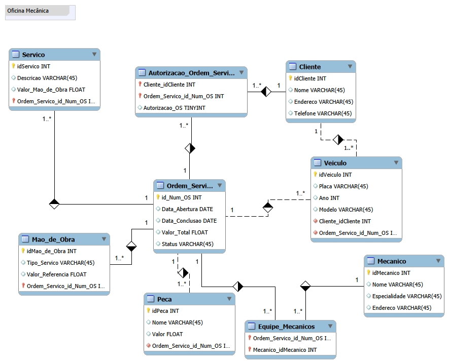

# DIO - Modelagem de Banco de Dados - Oficina Mecânica  
Projeto de modelagem conceitual para sistema de controle e gerenciamento de ordens de serviço em uma oficina mecânica, desenvolvido durante o desafio proposto pela Digital Innovation One (DIO).

## 📋 Sobre o Projeto  
Este projeto consiste na criação do esquema conceitual para um sistema de oficina mecânica, que gerencia clientes, veículos, equipes de mecânicos, ordens de serviço (OS), serviços e peças. O modelo contempla o ciclo completo desde o cadastro do cliente e veículo, passando pela criação e autorização da OS, até a execução dos serviços pela equipe designada.

## 🎯 Requisitos do Desafio Atendidos  
✅ Cadastro de clientes e seus veículos vinculados  
✅ Designação de equipes de mecânicos para cada veículo e OS  
✅ Registro detalhado das ordens de serviço com número, datas, status e valor total  
✅ Cálculo do valor da OS com base na tabela de referência de mão-de-obra e peças utilizadas  
✅ Controle do status da OS e autorização do cliente para execução dos serviços  
✅ Registro dos dados dos mecânicos, incluindo código, nome, endereço e especialidade  

## 📊 Modelo Conceitual  
  

O diagrama acima representa as entidades principais, seus atributos e os relacionamentos entre clientes, veículos, equipes, mecânicos, ordens de serviço, serviços e peças.

## 📝 Observações  
- A equipe de mecânicos é modelada como uma entidade que pode conter vários mecânicos, permitindo flexibilidade na composição das equipes.  
- O valor total da OS é calculado somando o custo da mão-de-obra (consultado na tabela de referência) e o valor das peças utilizadas.  
- O status da OS pode assumir valores como "Pendente", "Em andamento" e "Concluída".  
- Algumas suposições foram feitas para complementar a narrativa, como a inclusão do atributo telefone no cliente e a modelagem da autorização do cliente como parte do fluxo da OS.

# Autoria:  
# Autoria:
Caike Thiago Santos (**Caike Sannto**)

LinkedIn: https://www.linkedin.com/in/ctscaike/

GitHub: @ctscaike
